
# Project: "Ticketing system"

## React Client Application Routes

- Route `/login`: page contains login form and proper validation for each field. Used for users login into website.
- Route `/signup`: page contains form for creating a new user, and validation for each input. Used for creating new user. 
- Route `/` or `/ticket`: page contains tickets list and related ticket information. Used to view, search and retrieve particular ticket. 
- Route `/ticket/:id`: page contains info for specific ticket. Here users can add comment, edit latest added comment form them that has no reply, close ticket if is own ticket. Admin can do these also close and reopen any ticket and change category.
- Route `/create_ticket`: page contains create form for a ticket and relative validation for each input. User can create new ticket and check expiration in days. Otherwise admin can check expiration in days and hours. 
- Route `/profile`: page contains information of logged user. User can update information. 

## API Server

- POST `/login`
  - request parameters:
    - body:  `{username:'string', 'password': 'string'}`
  - response body content:  `{token: 'string', role:'string', 'username': 'string', 'timestamp': 'string' }`
- POST `/logout`
  - request parameters: 
    - headers:  `authorization: 'Bearer token'`
  - response body content:  `{'message': 'string', 'timestamp': 'string'}`
- POST `/signup`
  - request parameters: 
    - body:   `{username:'string', 'password': 'string', 'email': 'string', 'role':'string'}` &rarr;  `(roles: [admin, user])`
  - response body content:  `{'id': Number, 'username': 'string', 'role': 'string', 'email': 'string'}`

- POST `/auth`
  - request parameters: 
    - headers:  `authorization: 'Bearer token'`
  - response body content:  
  `{
    "auth": boolean,
    "timestamp": "string"
    }`

- GET `/ticket`
  - request parameters: 
    - query:   `?page=Number&size=Number`
  - response body content:  
    `[
      {
        "id": Number,
        "title": "string",
        "category": "string",
        "state": "string",
        "owner": "string",
        "timestamp": "string"
      }
    ]`

- POST `/ticket`
  - request parameters: 
    - headers:  `authorization: 'Bearer token'`
    - body:  
      ` {
        "title": "string",
        "category": "string",
        "text": "string"
        }`
    
  - response body content:  
  ` {
        "id": Number,
        "title": "string",
        "category": "string",
        "state": "string",
        "owner": "string",
        "timestamp": "string"
    }`

- POST `/ticket/:id`
  - request parameters: 
    - headers:  `authorization: 'Bearer token'`
    - params:   `id=Number`
    - body:  
      ` {
        "title": "string",
        "category": "string",
        "state": "string"
        }`
    
  - response body content:  
  ` {
        "id": Number,
        "title": "string",
        "category": "string",
        "state": "string",
        "owner": "string",
        "timestamp": "string",
        "textBlocks": 
        [
          {
            "id": Number,
            "text": "string",
            "timestamp": "string",
            "owner": "string",
            "ticket_id": Number
          }
        ]
    }`

- PUT `/ticket/:id/state/:state`
  - request parameters: 
    - headers:  `authorization: 'Bearer token'`
    - params:   `id=Number, state=String`
    
  - response body content:  
  ` {
        "message": "string", 
        "timestamp": "string"
    }`

- PUT `/ticket/:id/category/:category`
  - request parameters: 
    - headers:  `authorization: 'Bearer token'`
    - params:   `id=Number, category=String`
    
  - response body content:  
  ` {
        "message": "string", 
        "timestamp": "string"
    }`

- GET `/ticket/search/:searchWord`
  - request parameters: 
    - params:   `searchWord=String`
    
  - response body content:  
   `[
      {
        "id": Number,
        "title": "string",
        "category": "string",
        "state": "string",
        "owner": "string",
        "timestamp": "string"
      }
    ]`

- POST `/text_block/ticket/:ticket_id`
  - request parameters: 
    - headers:  `authorization: 'Bearer token'`
    - params:   `ticket_id=Number`
    - body:  
      ` {
          "text": "string"
        }`
    
  - response body content:  
  `
    {
      "id": Number,
      "text": "string",
      "timestamp": "string",
      "owner": "string",
      "ticket_id": Number
    }`

- POST `/text_block/ticket/:ticket_id`
  - request parameters: 
    - headers:  `authorization: 'Bearer token'`
    - params:   `ticket_id=Number`
    - body:  
      ` {
          "text": "string"
        }`
    
  - response body content:  
  `
    {
      "id": Number,
      "text": "string",
      "timestamp": "string",
      "owner": "string",
      "ticket_id": Number
    }`

- PUT `/text_block/:id`
  - request parameters: 
    - headers:  `authorization: 'Bearer token'`
    - params:   `id=Number`
    - body:  
      ` {
          "text": "string"
        }`
    
  - response body content:  
  `
    {
      "id": Number,
      "text": "string",
      "timestamp": "string",
      "owner": "string",
      "ticket_id": Number
    }`

- DELETE `/text_block/:id`
  - request parameters: 
    - headers:  `authorization: 'Bearer token'`
    - params:   `id=Number`
    - body:  
      ` {
          "text": "string"
        }`
    
  - response body content:  
  ` {
        "message": "string", 
        "timestamp": "string"
    }`

- GET `/profile`
  - request parameters: 
    - headers:  `authorization: 'Bearer token'`
  - response body content:  
  ` {"id":Number,"username":"string","email":"string","role":"string"}`

- PUT `/profile`
  - request parameters: 
    - headers:  `authorization: 'Bearer token'`
    - body:   `{"username": "string", "email": "string"}`
  - response body content:  
  ` {
        "message": "string", 
        "timestamp": "string"}`

- PUT `/profile/change_password`
  - request parameters: 
    - headers:  `authorization: 'Bearer token'`
    - body:   `{"oldPassword": "string", "newPassword": "string"}`
  - response body content:  
  ` {
        "message": "string", 
        "timestamp": "string"}`

## API Server2

- GET `/api/something`
  - request parameters: 
    - headers:  `authorization: 'Bearer token'`
    - body:   
      `[
        {
          "id": Number,
          "title": "string",
          "category": "string",
          "state": "string",
          "owner": "string",
          "timestamp": "string"
        }
      ]`  or 
      `  {
          "id": Number,
          "title": "string",
          "category": "string",
          "state": "string",
          "owner": "string",
          "timestamp": "string"
        }`
  - response body content:
       `[
        {
          "id": Number,
          "title": "string",
          "category": "string",
          "state": "string",
          "owner": "string",
          "timestamp": "string",
           "expire": {
            "days": Number,
            "hours": Number
          }
        }
      ]`  or 
      `  {
          "id": Number,
          "title": "string",
          "category": "string",
          "state": "string",
          "owner": "string",
          "timestamp": "string",
           "expire": {
            "days": Number,
            "hours": Number
          }
        }`

## Database Tables

- Table `User` - contains `(id, username, email, role,  password, salt)`
- Table `Ticket` - contains `(id, title, category,  state, timestamp, owner)` owner is foreign key with reference User(username)
- Table `TextBlock` - contains `(id, text, timestamp, owner, ticket_id)` owner and ticket_id foreign keys with references User(username) and Ticket(id)
- Table `Session` - contains `(id, token, username)` username foreign key with reference User(username) 

## Main React Components

- `Tickets` (in `TicketsRouter.jsx`): component show all tickets available, can direct to particular ticket, can direct to create ticket and provide search. 
- `TicketTable` (in `TicketTableComponent.jsx`): component used to arrange ticket in a table format.
- `Ticket` (in `TicketRoute.jsx`): component show detailed info for particular ticket. Here are also listed text block. Admin can open close any ticket, change category add new comment (text block). User can only close his/her own ticket and can add comment to ticket. 
- `TextBlock` (in `TextBlockComponent.jsx`): component gives information for each text added to ticket. Can be edited and deleted if is created by logged user and is the last comment without response. 
- `CreateTicket` (in `CreateTicketRoute.jsx`):  component contain the form for creating new ticket and related validation for each field. Before confirmation will be shown a modal that summarize information and calculate the expiration (admin days and hours and for user only days). 
- `RequireAuth` (in `RequireAuthComponent.jsx`):  component that checks if user is logged in and has proper authorization to access authorized routes. 
- `Login` (in `LoginRoute.jsx`): component that contains login form and proper input validation. 
-  `SignUp` (in `SignUpRoute.jsx`): component that contains signUp form and proper input validations.
- `Profile` (in  `ProfileRoute.jsx`) : component shows logged user information. Here users can update email, username and password.

## Screenshot

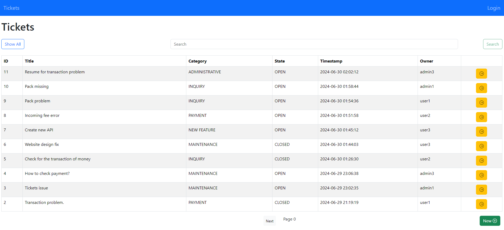

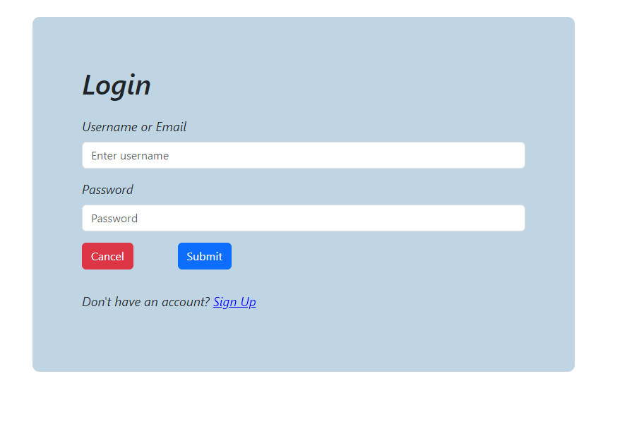

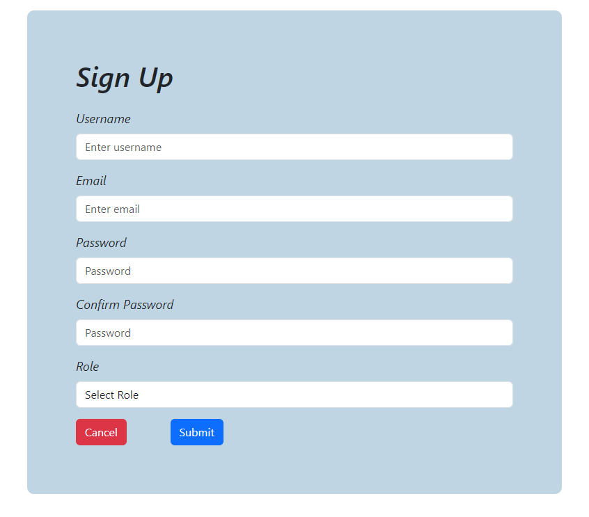

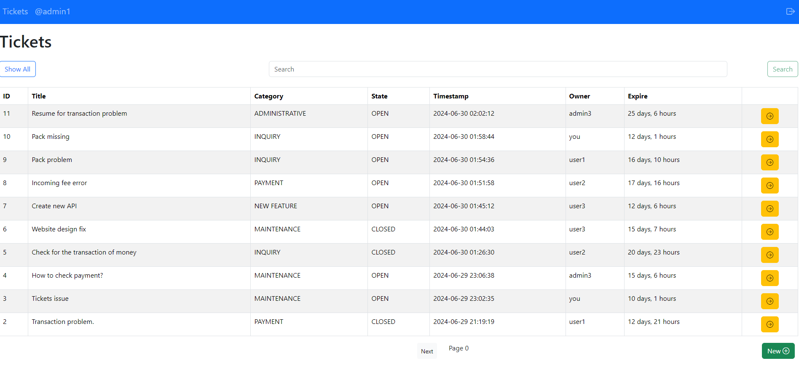

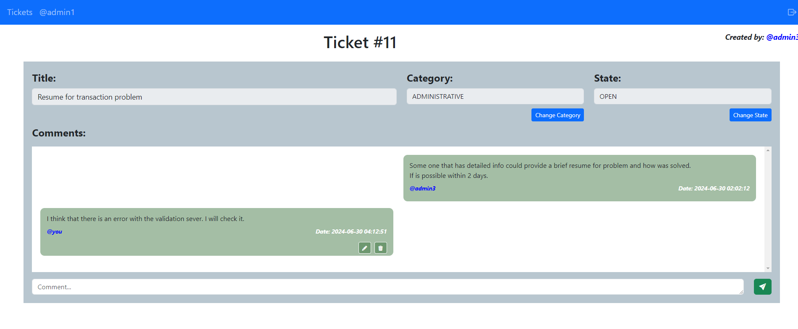

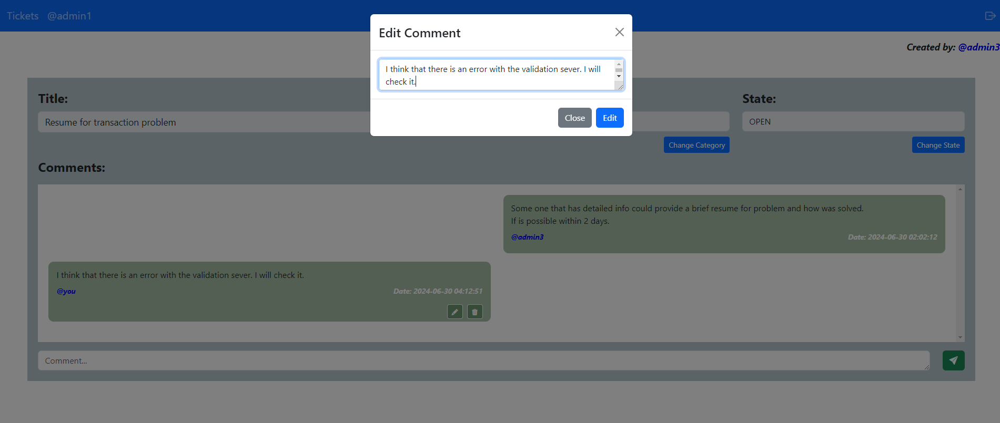

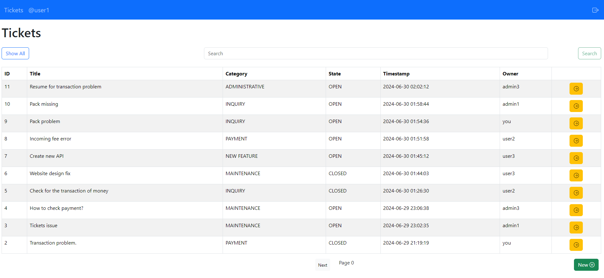

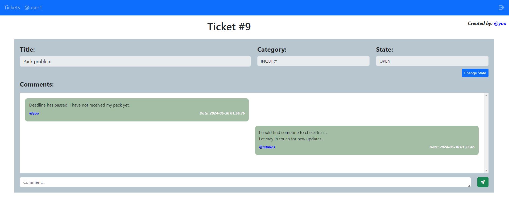

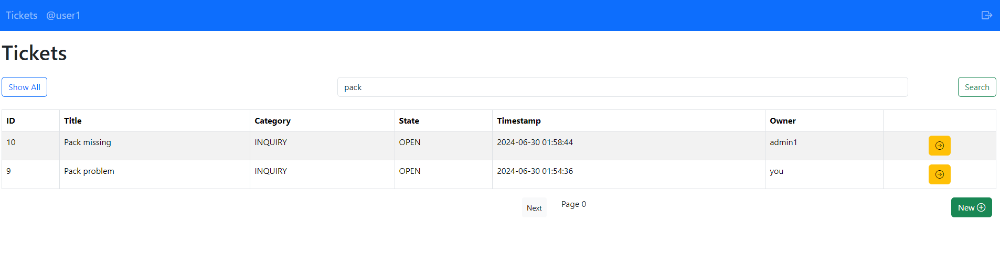

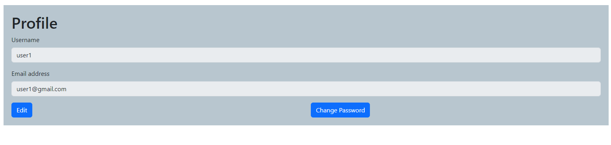

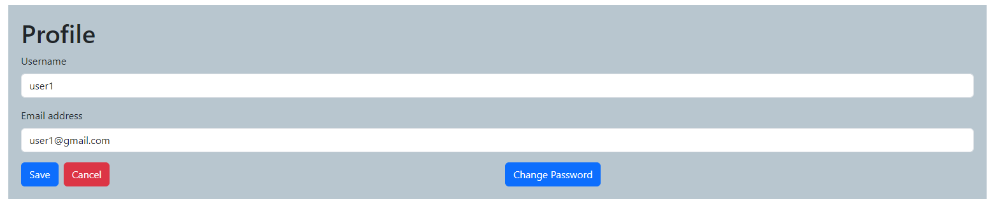

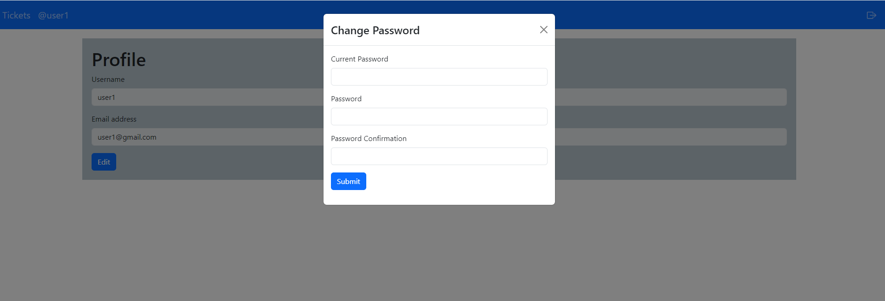

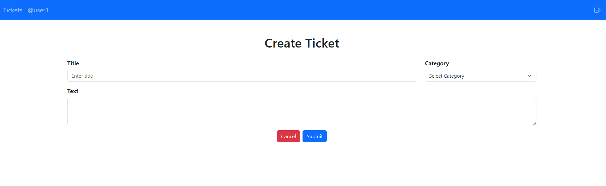

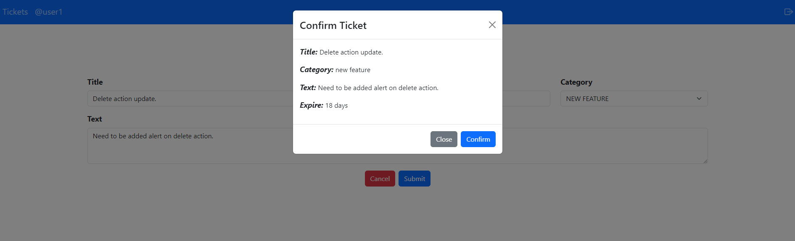

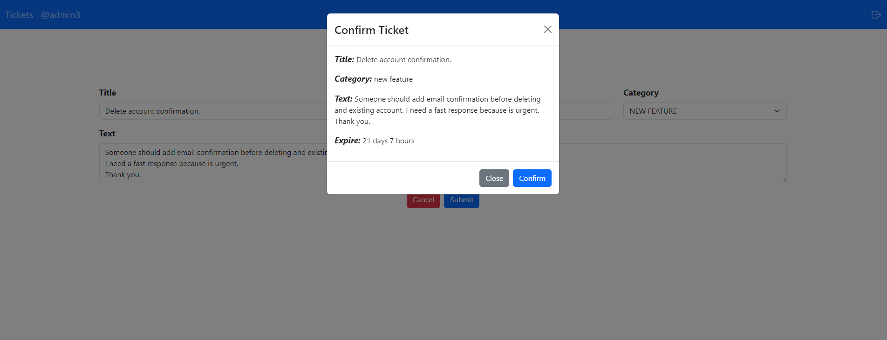

## Users Credentials

- admin1, admin123 (or use email: admin1@gmail.com)
- admin3, admin123 (or use email: admin3@gmail.com)
- user1, user123 (or use email: user1@gmail.com)
- user2, user123 (or use email: user2@gmail.com)
- user3, user123 (or use email: user3@gmail.com)

